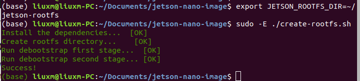
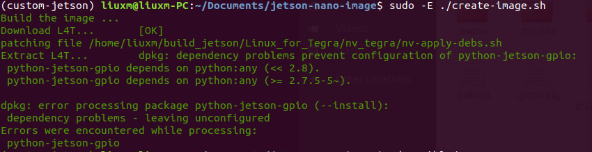
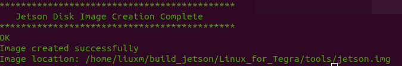
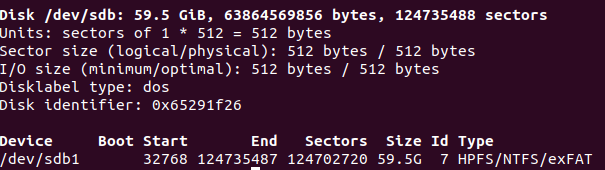

# Custom own Image for Jetson Nano
> 参考：
> - https://pythops.com/post/create-your-own-image-for-jetson-nano-board.html  
> - https://codepyre.com/2019/08/building-custom-root-filesystems/

> 说明：
> - 希望自定义 NVIDIA Jetson Nano 板镜像文件，去掉不必要的应用，同时安装常用的 Python、ROS 等工具。参考了上述链接中的内容，对所需做了修改。计划考虑有最小桌面版以及仅命令行的两种。  
> - 可以自行阅读相关脚本文件，已对其进行注释。（todo）

## 第一次操作指南：
1）下载该脚本文件：
- $ git clone git@github.com:LIU-Xueming/jetson-nano-image.git
- $ cd jetson-nano-image

2）创建 rootfs
- $ export JETSON_ROOTFS_DIR=~/jetson-rootfs  # 自定义 rootfs 的路径
- $ sudo -E ./create-rootfs.sh 
> From man sudo :  
> -E, --preserve-env  
> Indicates to the security policy that the user wishes to preserve their existing 
> environment variables. The security policy may return an error if the user does 
> not have permission to preserve the environment.  

3）定制 rootfs
- 安装 ansible，由于使用的是 conda 环境，所以需要按照 conda 的相关配置
  - $ conda create --name custom-jetson --clone base
  - $ conda activate custom-jetson
  - $ conda install -c conda-forge ansible
- 检查安装情况
  - $ which ansible-playbook
  - 以上命令将会有输出 ansible 被安装的位置
- 修改 /ansible 目录下的相关文件进行定制，如ubuntu版本、用户名、密码、网络、相关包配置等。需要注意ubuntu版本要一致。
- $ sudo -E $(which ansible-playbook) jetson.yaml
- 多次修改软件包名称，以及由于网络原因需要进行多次重复，同时注意18.04需要添加 - python，因为jetson的gpio口似乎仅支持python2。7？？？？？  

4）创建 Image
- $ export JETSON_NANO_BOARD=jetson-nano
- $ export JETSON_BUILD_DIR=~/build_jetson  
  
> Image location: /home/liuxm/build_jetson/Linux_for_Tegra/tools/jetson.img

5）烧录SD卡
- $ sudo ./flash-image.sh /path/to/jetson.img /dev/sdb
- 通过 sudo fdisk -l 查看设备名称，选择块设备，即 Disk  
  

- `echo $(which ansible-playbook)`
- `sudo -H pip install ansible` 在base中不需要-H，因为pip是python3的pip
- `pip uninstall ansible`

- item=libunwind8
- item=libreadline8   --- 改为7
- item=libdrm-common

## Instructions here:

https://pythops.com/post/create-your-own-image-for-jetson-nano-board.html

## Spec:
**Ubuntu release**: 20.04

**BSP**: 32.5.1

## Supported boards:
- [Jetson nano](https://developer.nvidia.com/embedded/jetson-nano-developer-kit)
- [Jetson nano 2GB](https://developer.nvidia.com/embedded/jetson-nano-2gb-developer-kit)

## License
Copyright Badr BADRI @pythops

MIT

